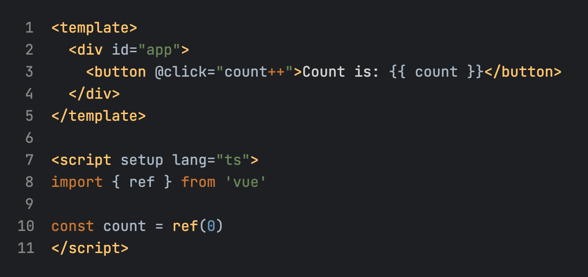

# JetBrains Dark Theme
A Visual Studio Code theme extension based on the JetBrains IDEs Dark theme.



## Why
The reason for making this theme extension is that I really like the new dark theme of JetBrains. Please contact me to delete any infringement.

## Installation
1. Download the extension from the `Github Releases` page.
2. Open Visual Studio Code.
3. Go to Extensions (Ctrl+Shift+X).
4. Click on the three dots in the top right corner and select "Install from VSIX...".
5. Select the downloaded `.vsix` file.
6. After installation, go to this Extension and click on "Set Color Theme".

## Development
```
npm install vsce -g --save vsce
vsce package
```

## TODO
- [x] Background Color
- [x] Java Syntax Highlighting
- [x] Python Syntax Highlighting
- [x] Typescript Syntax Highlighting
- [x] Vue Syntax Highlighting
- [x] HTML Syntax Highlighting
- [x] CSS Syntax Highlighting
- [ ] C Syntax Highlighting
- [ ] C++ Syntax Highlighting

## Recommend Setting
```json
{
  "editor.fontFamily": "JetBrains Mono, Consolas",
  "editor.fontSize": 16,
  "editor.lineHeight": 1.5
}
```

**Enjoy!🎉**
